# Blackjack Royale

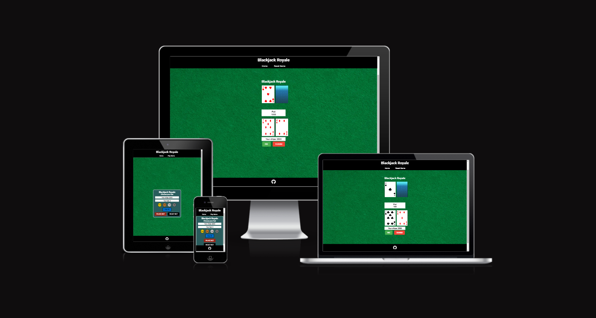

Blackjack Royale is a Javascript game build to allow users to play a game of blackjack online for fun. Built emulate real life gambling without the real life risk.

## Features

### Site wide
* Navigation menu
    * Contains links to the Home and Game pages and will be responsive on all devices.


    * This will allow users to easily navigate between the pages within the site on any size device. 

* Footer
    * This will contain a link to my GitHub page and a font awesome icon to make it more visually appealing. Link will open in a new tab when clicked.
    * This will allow the user to follow me on my Github page


* Favicon
    * A site wide favicon will be implemented with a red poker chip.
    * This will provide an image in the the tabs header to allow the user to easily identify the website if they have multiple tabs open.


* 404 page
    * A 404 page will be implemented and will display if a user navigates to a broken link.
    * The 404 page will allow the user to easily navigate back to the main website if they direct to a broken link / missing page, without the need  of the browsers back button.

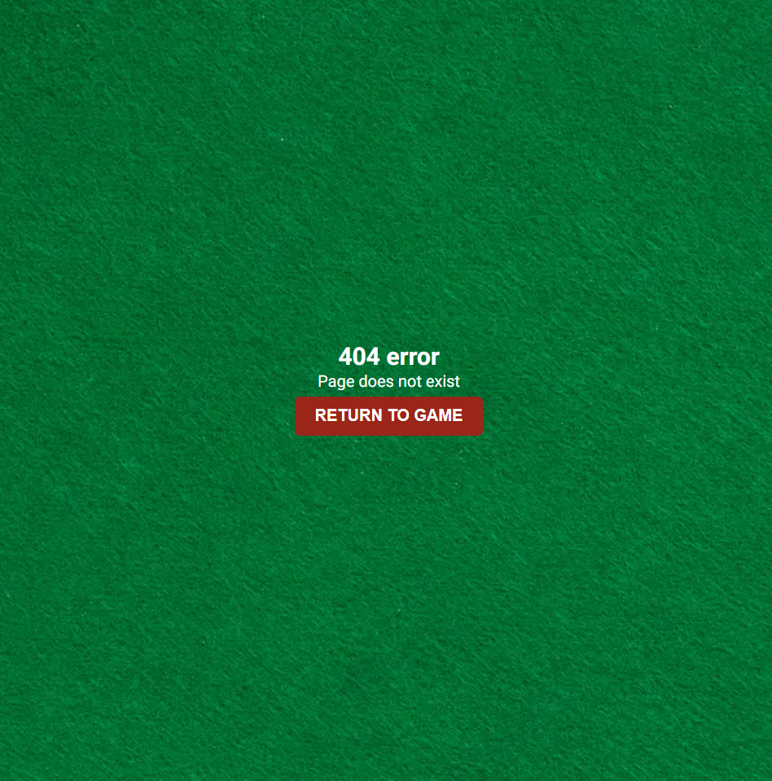

### Home Screen
- Game Rules
    - instructions for the game so the user is informed on how to play and get the most out of the app.

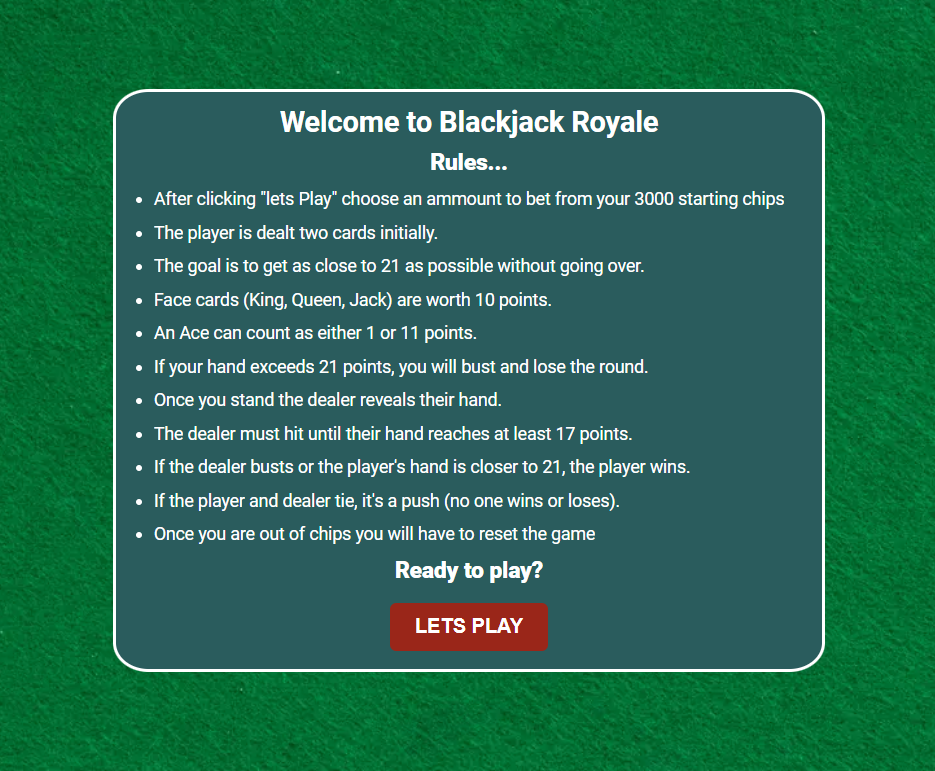

- Lets Play button
    - A button that will cause the game screen to be displayed.


### Game Screen
- Dealers hand
    - images of the cards that the dealer is holding to help the user make an informed decision when playing the game simulating the real life experience.

- players hand
    - To show the user what cards they are holding.

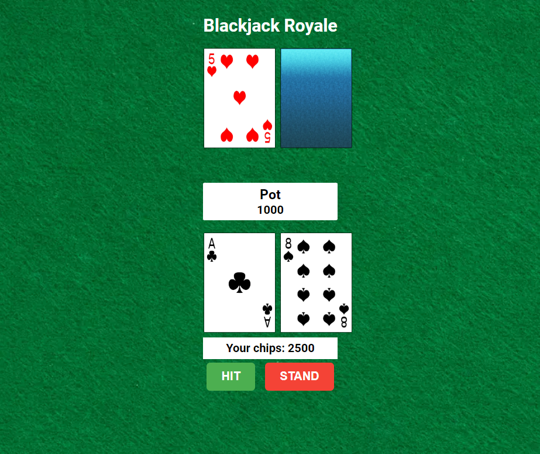

- Game controls
    - So the user can interact and have control over the game.

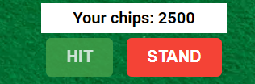

### Betting options
- This area will include the amount of chips the player has and the amount they have betted, the chips on the screen act as buttons the user can select from to place a bet.

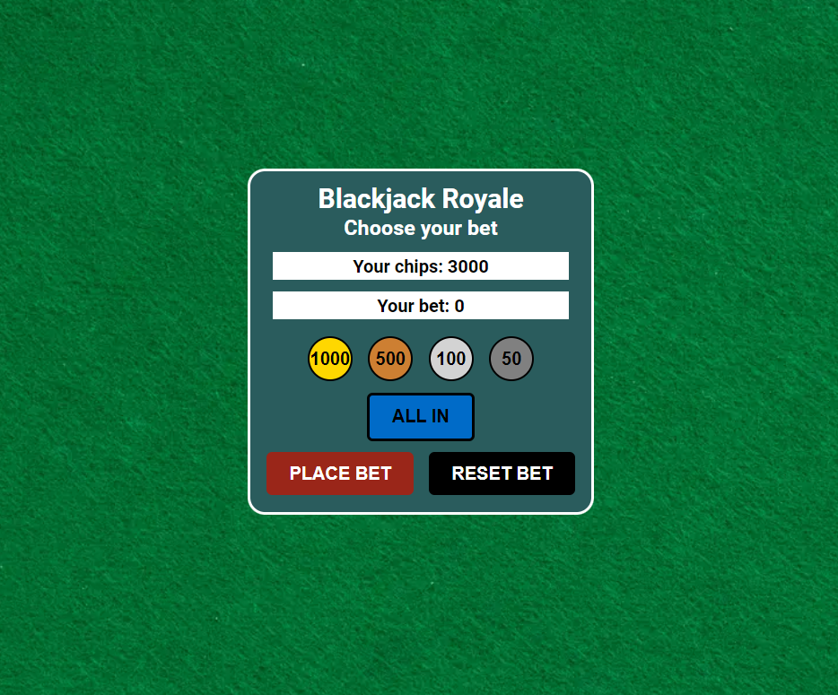

- Controls
  - The controls will allow the user to reset the bet or place the bet and start the game.

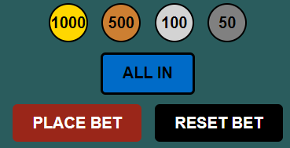

### End game screen
- Feedback
    - This area will provide feedback to the user to describe wether they won or lost the game.
- Play again button
    - A button giving the user the option to play again.

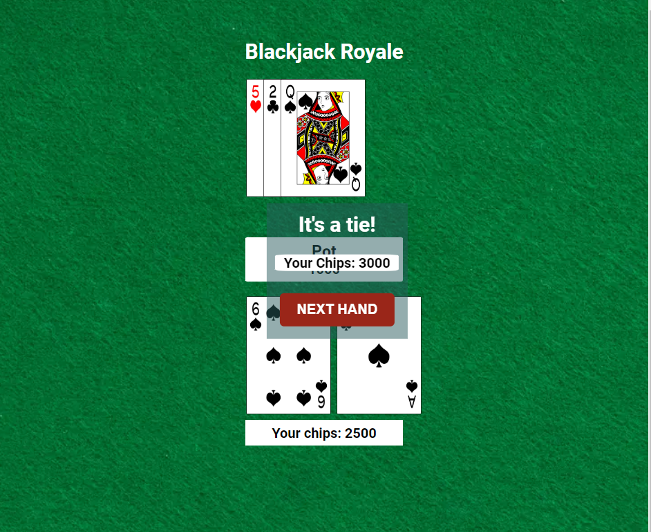

## Future features
To improve accessibility in the future i'd make the cards screen reader friendly this would mean that the user could find the value of there hand and make informed decisions to play the game.
To do this i would use the aria-label attribute within the card html elements, not forgetting the ones created within the javascript.

## Design

### Color pallette
This is the color pallette that has inspired the colors for my game.

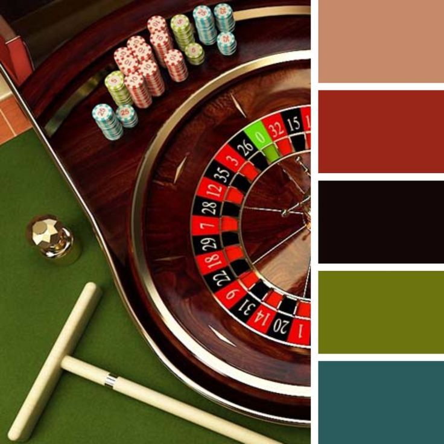

### Wire frames
- Home Screen

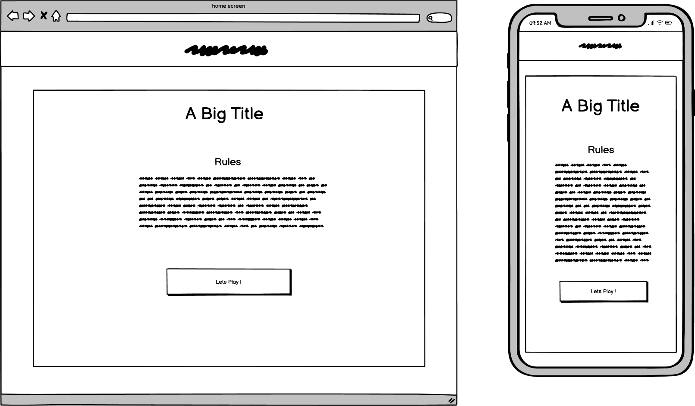

- Game Screen

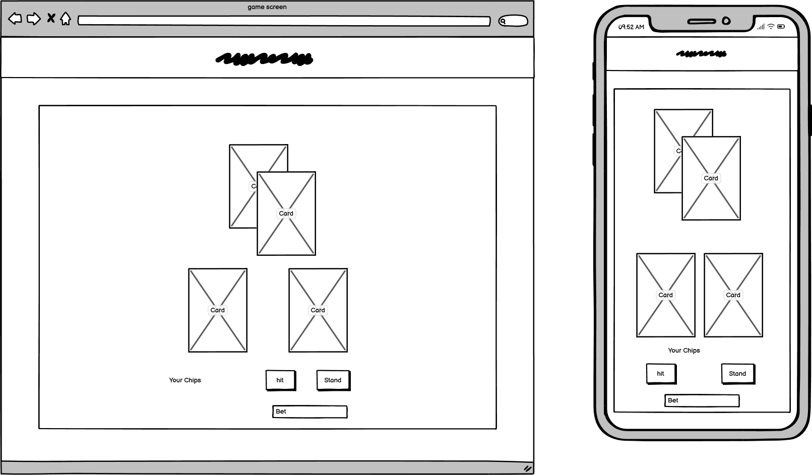

- End game screen

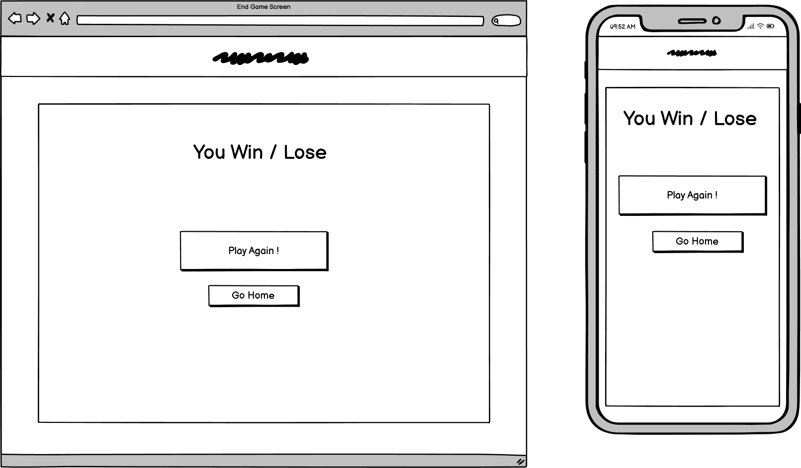

## Technologies

- HTML
  - The structure of the Website was developed using HTML as the main language.
- CSS
  - The Website was styled using custom CSS in an external file.
- JavaScript
  - The game play logic was created using JavaScript in an external file.
- Visual Studio Code
  - The website was developed using Visual Studio Code IDE
- GitHub
  - Source code is hosted on GitHub and deployed using Git Pages.
- Git
  - Used to commit and push code during the development of the Website
- Font Awesome
  - Icon obtained from https://fontawesome.com/ was used for GitHub Icon in the footer.
- Favicon.io
  - favicon files were created at https://favicon.io/favicon-converter/
- Balsamiq
  - wireframes were created using balsamiq from https://balsamiq.com/wireframes/desktop/#
- Canva
  - This was used to create the favicon

## Testing

### Responsiveness

All pages were tested to ensure responsiveness on screen sizes from 320px and upwards as defined in [WCAG 2.1 Reflow criteria for responsive design](https://www.w3.org/WAI/WCAG21/Understanding/reflow.html) on Chrome, Edge, Firefox and Opera browsers.

Steps to test:

1. Open browser and navigate to [BlackJack Royale](https://jxkeorton.github.io/blackjack/)
2. Open the developer tools (right click and inspect)
3. Set to responsive and decrease width to 320px
4. Set the zoom to 50%
5. Click and drag the responsive window to maximum width

Expected:

Website is responsive on all screen sizes and no images are pixelated or stretched.
No horizontal scroll is present.
No elements overlap.

Actual:

Website behaved as expected.

Website was also opened on the following device and no responsive issues were seen:

IPhone X

### Accessibility

[Wave Accessibility](https://wave.webaim.org/) tool was used for final testing of the deployed website to check for any aid accessibility testing.

- I found contrast errors on the All-in button and certain Headings which were corrected.

Testing was focused to ensure the following criteria were met:

- All forms have associated labels or aria-labels so that this is read out on a screen reader to users who tab to form inputs
- Color contrasts meet a minimum ratio as specified in [WCAG 2.1 Contrast Guidelines](https://www.w3.org/WAI/WCAG21/Understanding/contrast-minimum.html)
- Heading levels are not missed or skipped to ensure the importance of content is relayed correctly to the end user
- All content is contained within landmarks to ensure ease of use for assistive technology, allowing the user to navigate by page regions
- All not textual content had alternative text or titles so descriptions are read out to screen readers
- HTML page lang attribute has been set
- Aria properties have been implemented correctly
- WCAG 2.1 Coding best practices being followed

### Functional testing

| Test                                      | Steps                                | Expected                                               | Actual                                                                                                                             |
| ----------------------------------------- | ------------------------------------ | ------------------------------------------------------ | ---------------------------------------------------------------------------------------------------------------------------------- |
| Navigation Links                          | Check links work from any game phase | Redirects to relevant game area                        | Game didnt reset state properly from game area - this was fixed by using the resetGame function instead of the startGame function. |
| Footer Link                               | Click github icon                    | redirects to github page in new tab                    | As expected                                                                                                                        |
| Lets Play button                          | click lets play button               | shows betting options screen                           | As expected                                                                                                                        |
| Chip 1000                                 | click 1000 chip                      | adds 1000 to bet if player has enough                  | adds 1000 to bet if player has enough                                                                                              |
| Chip 500                                  | click 500 chip                       | adds 500 to bet if player has enough                   | adds 500 to bet if player has enough                                                                                               |
| Chip 100                                  | click 100 chip                       | adds 100 to bet if player has enough                   | adds 100 to bet if player has enough                                                                                               |
| Chip 50                                   | click 50 chip                        | adds 50 to bet if player has enough                    | adds 50 to bet if player has enough                                                                                                |
| All In Button                             | click all in button                  | bets all remaining player chips                        | bets all remaining player chips                                                                                                    |
| bet when player does'nt have enough chips | bet more chips than player has       | alert message to indicate the error                    | Indicates that player is all in and refuses bet                                                                                    |
| Place Bet Button                          | click place bet button               | game area opens and cards dealt                        | game area opens and cards dealt                                                                                                    |
| Reset Bet Button                          | click reset bet button               | the bet amount is reset to zero, player chips regained | the bet amount is reset to zero, player chips regained                                                                             |
| Hit Button                                | click hit button                     | a new card dealt to players hand                       | a new card dealt to players hand                                                                                                   |
| Hit to go bust                            | click until players hand is over 21  | player goes bust , dealer takes turn, results shown    | player goes bust , dealer takes turn, results shown                                                                                |
| Stand Button                              | click stand button                   | dealer takes turn game results shown                   | dealer takes turn game results shown                                                                                               |
| Outcome - Win                             | win game                             | displays relevant title and chips in end game area     | displays relevant title and chips in end game area                                                                                 |
| Outcome - Lose                            | lose game                            | displays relevant title and chips in end game area     | displays relevant title and chips in end game area                                                                                 |
| Outcome - Lose all chips                  | bet and lose all chips               | displays relevant title and button says reset game     | displays relevant title and button says reset game                                                                                 |
| Outcome - Tie                             | tie game with dealer                 | displays relevant title and chips in end game area     | displays relevant title and chips in end game area                                                                                 |

### Validators
* HTML
No issues were found with the HTML validation.

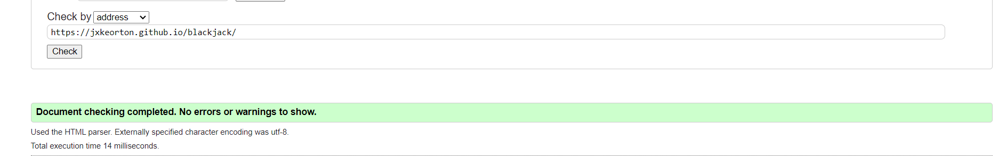

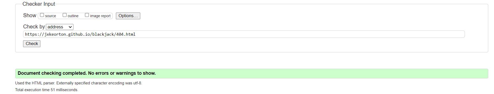

* CSS
No issues were found using the CSS validation.

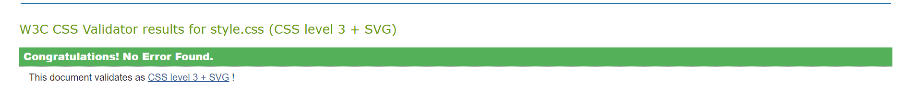

* Javascript
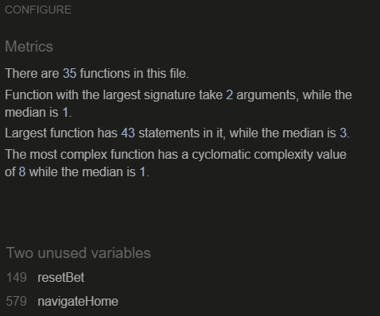

- JSHint helped me correct missing semi colons and undefined variables withing my code.
- The resetBet and navigateHome functions were called within the html, this is why JSHint thinks they are unused.

### Lighthouse
- After the first run i noticed i had not got a meta description, after correcting this here are the lighthouse results.

## Deployment

### Version Control

The site was created using the Visual Studio Code editor and pushed to github to the remote repository ‘Blackjack Royale’.

The following git commands were used throughout development to push code to the remote repo:

```git add <file>``` - This command was used to add the file(s) to the staging area before they are committed.

```git commit -m “commit message”``` - This command was used to commit changes to the local repository queue ready for the final step.

```git push``` - This command was used to push all committed code to the remote repository on github.

### Deployment to Github Pages

- The site was deployed to GitHub pages. The steps to deploy are as follows:
  - In the GitHub repository, navigate to the Settings tab
  - From the menu on left select 'Pages'
  - From the source section drop-down menu, select the Branch: main
  - Click 'Save'
  - A live link will be displayed in a green banner when published successfully.

The live link can be found here - https://jxkeorton.github.io/blackjack/

### Clone the Repository Code Locally

Navigate to the GitHub Repository you want to clone to use locally:

- Click on the code drop down button
- Click on HTTPS
- Copy the repository link to the clipboard
- Open your IDE of choice (git must be installed for the next steps)
- Type git clone copied-git-url into the IDE terminal

The project will now have been cloned on your local machine for use.

## Credits
* [Image color picker](https://imagecolorpicker.com/)
used to choose colors based off of the color pallette

* [Favicon Converter](https://favicon.io/favicon-converter/)
To convert the favicon image into the needed image sizes

* [Canva](https://www.canva.com/)
To design the favicon

* [Open Game Art](https://opengameart.org/)
For the images of the cards
